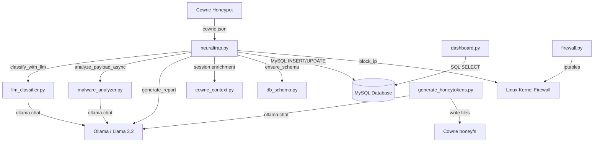

# 📘 NeuralTrap — Technical Documentation

---

## Table of Contents

1. [System Overview](#1-system-overview)
2. [Architecture & Data Flow](#2-architecture--data-flow)
3. [Module Reference](#3-module-reference)
4. [Database Schema](#4-database-schema)
5. [AI Engine Details](#5-ai-engine-details)
6. [Dashboard Pages](#6-dashboard-pages)
7. [Configuration & Deployment](#7-configuration--deployment)
8. [Testing Guide](#8-testing-guide)
9. [Troubleshooting](#9-troubleshooting)

---

## 1. System Overview

NeuralTrap is a modular, event-driven cybersecurity platform. It consists of five layers:

| Layer | Component | Role |
|---|---|---|
| **Deception** | Cowrie SSH Honeypot | Emulates a Linux server on port 2222 to attract attackers |
| **Ingestion** | `neuraltrap.py` (LogHandler) | Watches `cowrie.json` via Watchdog, parses every event in real time |
| **Intelligence** | `llm_classifier.py`, `malware_analyzer.py`, `forensic_analyst.py` | LLM-powered analysis: classification, scoring, reports, malware reverse engineering |
| **Response** | `firewall.py` + iptables integration in `neuraltrap.py` | Automatic IP blocking when threat score ≥ 85% |
| **Visualization** | `dashboard.py` (Streamlit) | 11-page cyberpunk command center with real-time charts and maps |

### Event Lifecycle

```
Attacker connects via SSH (port 2222)
  → Cowrie logs JSON event to ~/cowrie/var/log/cowrie/cowrie.json
    → Watchdog triggers LogHandler.on_modified()
      → process_event() parses the JSON line
        → Event is stored in attack_logs table
        → Session state is enriched (auth, files, client fingerprint, dwell)
        → If command input:
            → rule_based_score() scores the individual command via LLM
            → Every 3 commands OR on dangerous keyword: classify_with_llm() runs
            → If threat ≥ 85%: block_ip() + generate_report() in background threads
        → If session closed:
            → Final LLM classification
            → Session summary flushed to DB
            → Forensic report generated
```

---

## 2. Architecture & Data Flow

### Component Dependency Graph



### Threading Model

NeuralTrap uses Python's `threading` module for parallel processing:

| Thread | Trigger | Function |
|---|---|---|
| **Main thread** | Watchdog `on_modified` | `process_event()` — parses logs, enriches sessions, stores to DB |
| **LLM classification thread** | Every 3 commands or dangerous keyword | `run_llm_classification()` — calls `classify_with_llm()` |
| **Report generation thread** | Threat score ≥ 85% or session close | `generate_report()` — calls Ollama for forensic report |
| **Malware analysis thread** | File download event detected | `analyze_payload_async()` → `analyze_payload_sync()` |

All spawned threads are `daemon=True`, ensuring they terminate when the main process exits.

---

## 3. Module Reference

### 3.1 `neuraltrap.py` — Core Engine (849 lines)

The central orchestrator. Responsibilities:

- **Log watching**: Uses `watchdog.Observer` to monitor `~/cowrie/var/log/cowrie/` for changes to `cowrie.json`.
- **Event routing**: The `process_event()` method dispatches based on `eventid`:

| Event ID | Action |
|---|---|
| `cowrie.session.connect` | Creates new session state, flushes initial summary |
| `cowrie.client.version` | Stores SSH client version string |
| `cowrie.client.kex` | Stores HASSH fingerprint and KEX algorithms |
| `cowrie.session.params` | Stores session architecture |
| `cowrie.login.failed` | Increments fail count, stores in `login_attempts` table |
| `cowrie.login.success` | Marks login success, stores in `login_attempts` table |
| `cowrie.client.fingerprint` | Stores SSH public key fingerprint |
| `cowrie.session.file_download` | Tracks download, triggers malware analysis |
| `cowrie.session.file_upload` | Tracks upload metadata |
| `cowrie.log.closed` | Stores TTY log filename and metadata |
| `cowrie.command.input` | **Core path**: honeytoken check → rule-based score → LLM classification trigger |
| `cowrie.session.closed` | Finalizes dwell time, runs final LLM classification, generates report |

- **Session management**: `active_sessions` dict tracks all live sessions with full state (commands, scores, auth data, files, etc.).
- **Honeytoken detection**: Checks commands against known honeytoken paths (`id_rsa`, `.aws/credentials`, `wp-config.php`). Triggers instant block + report.
- **Auto-blocking**: When `threat_score ≥ 0.85`, calls `block_ip()` and spawns report thread.

**Key functions:**

| Function | Purpose |
|---|---|
| `get_db()` | Returns a new MySQL connection |
| `create_tables()` | Calls `ensure_schema()` on startup |
| `_ensure_active_session(session_id, src_ip)` | Lazily creates session state if missing |
| `_flush_session_summary(cursor, db, session_id, session, closed_ts)` | Upserts into `session_summary` table |
| `_persist_labeled_session(...)` | Inserts into `labeled_sessions` with Cowrie sidecar data |
| `_finalize_dwell_on_close(session, data)` | Calculates dwell time from connect/close timestamps |
| `block_ip(ip, attack_type, score, session_id)` | Adds iptables DROP rule + DB record |
| `generate_report(...)` | Builds prompt with command timeline + intel, calls Ollama, stores in `forensic_reports` |
| `run_llm_classification(session_id)` | Calls `classify_with_llm()` with session context, stores in `realtime_scores` |

---

### 3.2 `llm_classifier.py` — AI Classifier (272 lines)

Two main functions:

**`classify_with_llm(commands_list, session_intel=None)`**
- Builds a system prompt defining the LLM's role as a cybersecurity expert.
- Sends the command list + optional session intel to Ollama (`llama3.2`).
- Expects JSON response with 6 fields: `attack_type`, `threat_score`, `confidence`, `reasoning`, `predicted_next`, `mitre_tactics`.
- Handles markdown-wrapped JSON, partial JSON, and text extraction fallbacks.
- Returns validated result via `validate_result()` or `fallback_result()` on failure.

**`rule_based_score(command)`**
- Despite the name, this is **LLM-powered** (not rule-based).
- Sends a single command to Ollama with a scoring prompt.
- Returns a float 0.0–1.0 representing threat level.
- Results are cached in `_score_cache` dict to avoid redundant LLM calls.

**Fallback chain:** JSON parse → regex field extraction → `fallback_result()` (score 0.1, type "Unknown Attack").

---

### 3.3 `forensic_analyst.py` — Forensic Report Generator (122 lines)

- `generate_forensic_report()`: Sends session data to Ollama with a structured prompt requesting WHO/WHAT/WHY/RISK/ACTION analysis.
- `process_unanalyzed_sessions()`: Queries `labeled_sessions` LEFT JOIN `forensic_reports` to find sessions without reports, generates up to 3 at a time.
- `add_analyst_feedback()`: Updates the `analyst_feedback` column for quality tracking.

---

### 3.4 `malware_analyzer.py` — Malware Intelligence Engine (105 lines)

- Triggered by `cowrie.session.file_download` events in `neuraltrap.py`.
- Locates downloaded files in `/home/kali/cowrie/var/lib/cowrie/downloads/` by SHA-256 hash.
- For text files: reads first 2000 characters directly.
- For binaries: extracts printable strings via the `strings` command.
- Sends content to Ollama requesting: `analysis_report` (malware family, capabilities) and `iocs` (IPs, domains, crypto wallets).
- Stores results in `malware_analysis` table.
- Runs asynchronously via `analyze_payload_async()` (daemon thread).

---

### 3.5 `cowrie_context.py` — Session Enrichment (157 lines)

Utility functions for Cowrie-specific data:

| Function | Purpose |
|---|---|
| `cowrie_home()` | Returns `~/cowrie` path |
| `parse_cowrie_timestamp(ts)` | Parses ISO timestamps (handles `Z` suffix) |
| `resolve_tty_path(ttylog_filename)` | Resolves TTY recording to absolute path |
| `new_session_state(src_ip)` | Returns a fresh session dict with 25+ fields |
| `redact_password(pw)` | Redacts passwords for LLM prompts (shows first char + length) |
| `format_session_intel_for_llm(session)` | Formats all session data into a plain-text block for LLM context |
| `kex_payload_for_db(data)` | Serializes KEX fields to JSON (max 8000 chars) |

---

### 3.6 `firewall.py` — Firewall Module (147 lines)

Standalone module for IP management:

| Function | Purpose |
|---|---|
| `block_ip(ip, attack_type, score, session_id)` | Adds `iptables -A INPUT -s IP -j DROP` rule |
| `unblock_ip(ip)` | Removes iptables rule + deletes DB record |
| `log_block(...)` | Inserts into `blocked_ips` table |
| `check_and_block(...)` | Checks threshold (85%) and blocks if exceeded |
| `process_high_threat_sessions()` | Batch-blocks all unblocked sessions with score ≥ 85% |
| `show_blocked_ips()` | Prints all blocked IPs |

---

### 3.7 `db_schema.py` — Database DDL (141 lines)

`ensure_schema(cursor, db)` creates all 10 tables with proper indexes and runs safe `ALTER TABLE` migrations for columns added after initial deployment.

### 3.8 `generate_honeytokens.py` — AI Honeytoken Generator (55 lines)

Uses Ollama to generate three realistic fake files placed in Cowrie's `honeyfs/`:

| Honeytoken | Path in Honeypot | Trigger |
|---|---|---|
| AWS Credentials | `root/.aws/credentials` | `cat .aws/credentials` |
| SSH Private Key | `root/.ssh/id_rsa` | `cat id_rsa` |
| WordPress Config | `var/www/html/wp-config.php` | `cat wp-config.php` |

### 3.9 `test_attack.py` — Attack Simulator (373 lines)

5 built-in scenarios with realistic command chains and session metadata:

| # | Scenario | Commands | Dwell |
|---|---|---|---|
| 1 | Cryptominer Deployment (XMRig) | 11 | 23.5s |
| 2 | Mirai-Style IoT Botnet | 10 | 8.1s |
| 3 | SSH Lateral Movement & Credential Theft | 12 | 187.4s |
| 4 | Linux Privilege Escalation & Rootkit | 14 | 95.3s |
| 5 | Slow & Stealthy Recon (APT-style) | 10 | 312.6s |

Features: per-command LLM scoring, progressive classification every 3 commands, final session analysis, score progression visualization, and interactive custom command mode.

### 3.10 Supporting Scripts

| Script | Purpose |
|---|---|
| `init_db.py` | One-shot: creates database + tables |
| `clear_db.py` | Truncates all tables for clean testing |
| `log_to_db.py` | Legacy standalone log watcher (attack_logs only) |
| `reclassify_with_llm.py` | Re-runs LLM classification on up to 500 existing sessions |
| `update_titles.py` | Updates dashboard page titles |
| `start_neuraltrap.sh` | Starts MariaDB → Cowrie → Ollama → Dashboard → Engine |
| `run_master_test.sh` | Orchestrates the full test suite |

---

## 4. Database Schema

### Entity Relationship

```
attack_logs ──────────┐
login_attempts ────────┤
file_transfers ────────┤── session_id ──→ session_summary
realtime_scores ───────┤                      │
honeytoken_triggers ───┘                      │
                                              ↓
                                     labeled_sessions
                                              │
                                              ↓
                                     forensic_reports
                                     blocked_ips
                                     malware_analysis
```

### Table Details

#### `attack_logs`
Every raw Cowrie event. The backbone of all data.

| Column | Type | Description |
|---|---|---|
| id | INT AUTO_INCREMENT PK | Row ID |
| session_id | VARCHAR(100) | Cowrie session identifier |
| timestamp | VARCHAR(100) | Cowrie timestamp string |
| event_type | VARCHAR(100) | e.g. `cowrie.command.input` |
| src_ip | VARCHAR(50) | Attacker IP address |
| command | TEXT | Command or human-readable event summary |
| raw_log | TEXT | Full JSON line from Cowrie |

Indexes: `idx_session(session_id)`, `idx_event(event_type)`

#### `realtime_scores`
Per-command AI threat assessments.

| Column | Type | Description |
|---|---|---|
| id | INT AUTO_INCREMENT PK | Row ID |
| session_id | VARCHAR(100) | Session reference |
| src_ip | VARCHAR(50) | Attacker IP |
| command | TEXT | The specific command scored |
| attack_type | VARCHAR(50) | LLM-assigned attack label |
| threat_score | FLOAT | 0.0–1.0 threat level |
| predicted_next | TEXT | AI's predicted next command |
| command_number | INT | Position in session sequence |
| mitre_tactics | TEXT | JSON array of MITRE technique IDs |
| created_at | TIMESTAMP | When scored |

#### `labeled_sessions`
Final session-level classifications with Cowrie enrichment.

| Column | Type | Description |
|---|---|---|
| id | INT AUTO_INCREMENT PK | Row ID |
| session_id | VARCHAR(100) UNIQUE | Session reference |
| src_ip | VARCHAR(50) | Attacker IP |
| commands | TEXT | Space-joined command string |
| attack_type | VARCHAR(50) | Final LLM classification |
| threat_score | FLOAT | Final threat score |
| dwell_seconds | DOUBLE | Session duration |
| client_version | VARCHAR(512) | SSH client string |
| hassh | VARCHAR(128) | HASSH fingerprint |
| tty_log_path | VARCHAR(1024) | Path to TTY recording |
| mitre_tactics | TEXT | JSON array of MITRE IDs |
| created_at | TIMESTAMP | When classified |

#### `session_summary`
Aggregated session metadata updated throughout the session lifecycle.

| Column | Type | Description |
|---|---|---|
| session_id | VARCHAR(100) PK | Session reference |
| src_ip | VARCHAR(50) | Attacker IP |
| connected_at / closed_at | DATETIME | Session time window |
| dwell_seconds | DOUBLE | Duration |
| client_version | VARCHAR(512) | SSH client |
| hassh | VARCHAR(128) | HASSH fingerprint |
| kex_json | TEXT | Key exchange algorithm details |
| session_arch | VARCHAR(64) | Reported architecture |
| ttylog_filename / tty_full_path | VARCHAR | TTY recording references |
| login_fail/success_count | INT | Auth attempt counters |
| download/upload/pubkey_count | INT | Activity counters |
| updated_at | TIMESTAMP | Last update |

#### `login_attempts`
Individual authentication events.

| Column | Type | Description |
|---|---|---|
| id | INT AUTO_INCREMENT PK | Row ID |
| session_id, src_ip | VARCHAR | References |
| event_type | VARCHAR(100) | `cowrie.login.failed`, `.success`, `.fingerprint` |
| username | VARCHAR(255) | Attempted username |
| password | VARCHAR(512) | Attempted password |
| success | TINYINT(1) | 0=failed, 1=success, NULL=pubkey |
| fingerprint | VARCHAR(255) | SSH public key fingerprint |
| key_type | VARCHAR(64) | Key algorithm type |

#### `file_transfers`
Uploads and downloads captured by the honeypot.

| Column | Type | Description |
|---|---|---|
| id | INT AUTO_INCREMENT PK | Row ID |
| direction | VARCHAR(20) | `download` or `upload` |
| url | TEXT | Download source URL |
| filename | VARCHAR(512) | Upload filename |
| outfile | VARCHAR(512) | Local storage path |
| shasum | VARCHAR(128) | SHA-256 hash |

#### `blocked_ips`
Automatically blocked IP addresses.

| Column | Type | Description |
|---|---|---|
| ip_address | VARCHAR(50) | Blocked IP |
| attack_type | VARCHAR(50) | Why blocked |
| threat_score | FLOAT | Score that triggered block |
| session_id | VARCHAR(100) | Triggering session |
| blocked_at | TIMESTAMP | When blocked |
| reason | TEXT | Human-readable reason |

#### `forensic_reports`
AI-generated incident reports.

| Column | Type | Description |
|---|---|---|
| session_id | VARCHAR(100) | Session reference |
| report | TEXT | Full LLM-generated report |
| analyst_feedback | VARCHAR(20) | `accurate` or `inaccurate` |
| created_at | TIMESTAMP | When generated |

#### `malware_analysis`
AI reverse engineering results for captured payloads.

| Column | Type | Description |
|---|---|---|
| shasum | VARCHAR(128) PK | File hash |
| session_id | VARCHAR(100) | Capturing session |
| url | TEXT | Download source |
| analysis_report | TEXT | LLM malware analysis |
| iocs | TEXT | JSON array of IOCs |

#### `honeytoken_triggers`
Alerts from honeytoken interactions.

| Column | Type | Description |
|---|---|---|
| session_id | VARCHAR(100) | Triggering session |
| src_ip | VARCHAR(50) | Attacker IP |
| token_type | VARCHAR(100) | e.g. "SSH Private Key", "AWS Credentials" |
| command_used | TEXT | Command that triggered detection |

---

## 5. AI Engine Details

### LLM Configuration

| Parameter | Value |
|---|---|
| **Model** | Llama 3.2 |
| **Runtime** | Ollama (local inference) |
| **API** | `ollama.chat()` and `ollama.generate()` |
| **Temperature** | 0.1 (for scoring), default (for classification/reports) |
| **Max tokens** | 80 (scoring), unlimited (classification/reports) |

### Classification System Prompt

The system prompt (in `llm_classifier.py`) instructs the LLM to act as a cybersecurity AI expert. It must return a JSON object with exactly 6 fields:

```json
{
  "attack_type": "Cryptominer Deployment",
  "threat_score": 0.92,
  "confidence": "high",
  "reasoning": "Attacker downloaded and executed XMRig with persistence via crontab.",
  "predicted_next": "The attacker will likely attempt to spread to other hosts via SSH.",
  "mitre_tactics": ["T1059.004", "T1496", "T1053.003"]
}
```

### Scoring Thresholds

| Score Range | Label | Dashboard Color | Action |
|---|---|---|---|
| 0.85–1.00 | **CRITICAL** | 🔴 Red | Auto-block IP + generate report |
| 0.50–0.84 | **HIGH RISK** | 🟠 Orange | Monitor closely |
| 0.25–0.49 | **MONITORING** | 🟡 Yellow | Standard monitoring |
| 0.00–0.24 | **LOW RISK** | 🟢 Green | No action |

### LLM Call Triggers

| Trigger | Function | Context |
|---|---|---|
| Every 3 commands | `run_llm_classification()` | Progressive session classification |
| Dangerous keyword detected | `run_llm_classification()` | Immediate classification |
| Each individual command | `rule_based_score()` | Per-command scoring (cached) |
| Session close | `classify_with_llm()` | Final session classification |
| Threat ≥ 85% | `generate_report()` | Forensic report generation |
| File download | `analyze_payload_sync()` | Malware analysis |
| Honeytoken generation | `generate_lure()` | Fake file creation |

### Dangerous Keywords

Commands containing any of these trigger immediate LLM classification:
`wget`, `curl`, `chmod`, `./`, `bash -i`, `python -c`, `cat /etc/shadow`, `nc `

---

## 6. Dashboard Pages

### Page 1: 🏠 Overview
- 4 HUD metric cards: Total Sessions, Commands Captured, IPs Blocked, High Threat Sessions
- Attack Type Distribution (pie chart)
- Threat Score by Attack Type (bar chart)
- Recent Attack Sessions table (last 10)

### Page 2: ⚔️ Live Attacks
- Real-time feed of `cowrie.command.input` events (last 50)
- Terminal-style display with green (normal) and red (dangerous) styling
- Shows IP, session ID, and full command

### Page 3: 🔬 Cowrie Intel
- Metrics: Login events, File transfers, Sessions summarized, Avg dwell time
- Recent login & pubkey events table
- File uploads & downloads table
- Session summaries with dwell, client, HASSH, TTY path
- Labeled sessions with Cowrie sidecar data

### Page 4: 🧠 AI Predictions
- All classified sessions sorted by threat score (descending)
- Per-session: IP, session ID, attack type, threat score progress bar, commands preview

### Page 5: 📋 Forensic Reports
- Expandable cards per session with full AI-generated report
- Analyst feedback buttons (Accurate ✅ / Inaccurate ❌)
- Current feedback status display

### Page 6: 🚫 Blocked IPs
- Metrics: Total Blocked IPs, Critical Threats Blocked
- Full blocked IPs table with attack type, score, timestamp, reason
- Attack type distribution bar chart

### Page 7: 👤 Attacker Profiles
- Grouped by IP address with session count
- Per-profile: Sessions, Avg Threat, Max Threat (HUD cards)
- Attack types list and threat progress bar
- Blocked/Monitoring status

### Page 8: 🌍 Attack World Map
- GeoIP-powered scatter map (Plotly `scatter_geo`) using MaxMind GeoLite2 database
- Top Attacking Countries bar chart
- Metrics: Countries Detected, Mapped Attack Sources

### Page 9: 📈 Live Threat Monitor
- Top 5 sessions with color-coded status (BLOCKED/HIGH RISK/MONITORING/LOW RISK)
- MITRE ATT&CK Tactic Frequency horizontal bar chart
- Threat Score Distribution histogram with 85% block threshold line
- Sessions Timeline (threat score over time) with block threshold
- Threat Statistics: High/Medium/Low/Avg counts

### Page 10: 🦠 Malware Intelligence
- Per-payload cards: SHA-256 hash, session ID, capture time, source URL
- AI analysis report display
- Extracted IOCs (IPs, domains, wallets) as code blocks

### Page 11: 🍯 Honeytoken Activity
- Metrics: Total Triggers, Unique IPs Trapped
- Full table: Session ID, Source IP, Token Type, Command Used, Triggered At

---

## 7. Configuration & Deployment

### Prerequisites

| Requirement | Version | Purpose |
|---|---|---|
| Linux (Kali recommended) | Any | Operating system |
| Python | 3.10+ | Runtime |
| MySQL / MariaDB | 5.7+ / 10.3+ | Database |
| Ollama | Latest | Local LLM inference |
| Llama 3.2 | Via `ollama pull` | AI model |
| Cowrie | Latest | SSH honeypot |

### Python Dependencies

```
streamlit
mysql-connector-python
pandas
plotly
ollama
watchdog
geoip2
```

### Startup Sequence (`start_neuraltrap.sh`)

```
1. sudo systemctl start mariadb         # Database
2. cd ~/cowrie && cowrie start           # Honeypot (port 2222)
3. sudo systemctl start ollama          # LLM engine
4. streamlit run dashboard.py &         # Dashboard (port 8501)
5. python3 neuraltrap.py                # Core engine (foreground)
```

### Network Ports

| Port | Service | Purpose |
|---|---|---|
| 2222 | Cowrie SSH | Honeypot entry point |
| 8501 | Streamlit | Dashboard web UI |
| 3306 | MySQL | Database |
| 11434 | Ollama | LLM API (localhost only) |

### Database Setup

```sql
CREATE DATABASE neuraltrap;
CREATE USER 'neuraltrap'@'localhost' IDENTIFIED BY 'neuraltrap123';
GRANT ALL PRIVILEGES ON neuraltrap.* TO 'neuraltrap'@'localhost';
FLUSH PRIVILEGES;
```

---

## 8. Testing Guide

### Quick Test

```bash
python3 test_attack.py                # Interactive menu
python3 test_attack.py --scenario 1   # Run specific scenario
python3 test_attack.py --custom       # Type your own commands
```

### Full Test Suite

```bash
bash run_master_test.sh
```

### Manual Verification

1. **Verify Cowrie**: `ssh root@localhost -p 2222` (password: anything)
2. **Verify LLM**: `ollama run llama3.2 "Hello"`
3. **Verify DB**: `mysql -u neuraltrap -p neuraltrap -e "SHOW TABLES;"`
4. **Verify Dashboard**: Open `http://localhost:8501`

---

## 9. Troubleshooting

| Problem | Solution |
|---|---|
| `ollama.chat` timeout | Ensure Ollama is running: `sudo systemctl start ollama` |
| MySQL connection refused | Start MariaDB: `sudo systemctl start mariadb` |
| No events captured | Check Cowrie is running: `~/cowrie/bin/cowrie status` |
| GeoIP map empty | Download GeoLite2-City.mmdb to `~/cowrie/geoip/` |
| Dashboard blank | Check MySQL has data: `SELECT COUNT(*) FROM attack_logs;` |
| LLM returns garbage | Restart Ollama; verify model: `ollama list` |
| iptables permission denied | Run neuraltrap.py with sudo for firewall features |
| Duplicate log entries | Don't run `log_to_db.py` and `neuraltrap.py` simultaneously |

---

<p align="center"><strong>📘 End of Technical Documentation</strong></p>
